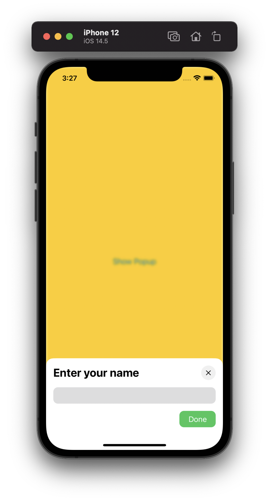

# Custom Popup Example

An example project for [Implementing custom popups in SwiftUI](https://artemnovichkov.com/blog/custom-popups-in-swiftui) article.

  

## Author

Artem Novichkov, https://www.artemnovichkov.com/about

## License

The project is available under the MIT license. See the [LICENSE](./LICENSE) file for more info.
